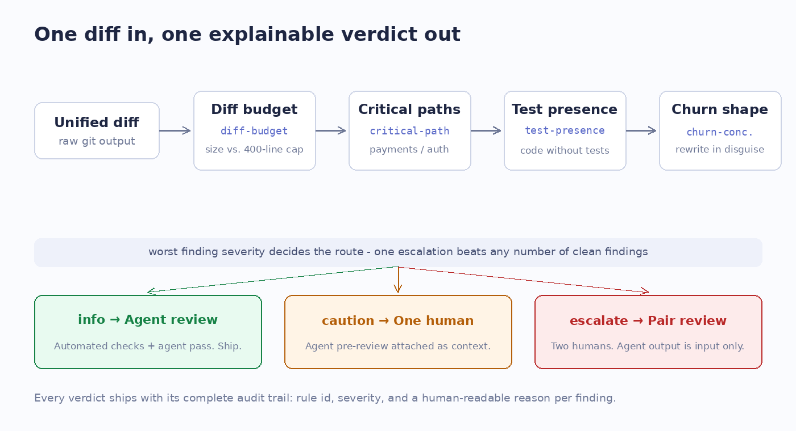

# ReviewGateKit — a verification pipeline for the post-AI code review bottleneck

A small, fully tested Swift library that treats code review capacity as a **resource allocated by policy, not vibes**: it parses a unified diff, runs it through an ordered stack of verification gates, and routes the change to the cheapest review tier that can actually catch its risk — with a complete audit trail explaining every verdict.

Companion repo to the article: [**AI Made Code Cheap. Code Review Just Became the Most Expensive Thing You Own.**](https://medium.com/p/2f72cb8d8abd)



## Why this exists

AI assistants made writing code cheap. They did nothing to make *verifying* code cheap. If your team's review process still treats every PR identically, your best reviewers are spending scarce attention on config renames while a "5-line" payments hotfix sails through with one tired approval.

ReviewGateKit is the smallest useful expression of the alternative: encode your review policy as data, evaluate every diff against it, and spend human attention only where the risk actually lives.

## What it does

```swift
import ReviewGateKit

let pipeline = VerificationPipeline.standard(
    criticalPrefixes: ["Sources/Payments", "Sources/Auth"]
)

let verdict = pipeline.evaluate(diffText: rawGitDiff)

verdict.routing    // .agentReviewSufficient | .singleHumanReview | .pairHumanReview
verdict.riskLevel  // .low | .moderate | .high
verdict.findings   // full audit trail: rule id, severity, human-readable reason
```

The standard gate stack:

| Gate | Rule id | What it catches |
|------|---------|-----------------|
| Diff budget | `diff-budget` | Oversized changes nobody can review well (default cap: 400 lines / 20 files) |
| Critical paths | `critical-path` | Any production change under payments/auth — escalates regardless of size |
| Test presence | `test-presence` | Production churn arriving with zero test changes |
| Churn shape | `churn-concentration` | A rewrite hiding inside a "small-looking" PR |

Routing is decided by the **worst** finding severity — one escalation beats any number of clean findings. A payments change doesn't get cheaper review because the README diff next to it was tidy.

## The demo app

`Demo/Demo.xcodeproj` is a SwiftUI app that lets you flip between three realistic diffs — a tidy refactor with tests, a feature landing without tests, and a tiny payments hotfix — and watch the pipeline route each one differently, with the full audit trail rendered per finding. The same three diffs (`SampleDiffs.swift`) are pinned by the test suite, so what the demo shows is exactly what the tests prove.

## How to run it

1. Clone this repo — everything is in this one repo, no second checkout needed.
2. Open `Demo/Demo.xcodeproj` in Xcode 15 or later.
3. Pick any iOS 17+ Simulator and Build & Run. The demo consumes the library through a local Swift Package reference (`XCLocalSwiftPackageReference`, relative path `..`) — no other setup.

Run the library's tests headlessly from the repo root with `swift test`.

## Verification status — honest and specific

- `swift build` and `swift test` were run for real on Swift 6.0.3 (Linux): **39/39 tests passing** — diff-parser edge cases (renames, binary files, header lines never counted, malformed headers), rule boundary conditions (exactly-at-budget, exactly-at-escalation-threshold), and pipeline routing invariants (worst-severity-wins, deterministic repeated evaluation, every-verdict-carries-findings).
- `project.pbxproj` was hand-authored and machine-checked: brace/paren balanced, all 22 object IDs cross-referenced with zero dangling references; the shared scheme is XML-validated; both demo Swift files pass `swiftc -parse`.
- **The demo app has NOT been run on a Simulator.** This repo was produced by an unattended scheduled automation run, and computer-use access for Xcode/Simulator is hard-blocked during scheduled runs (the access request was made twice and refused both times with "can't be approved during a scheduled run"). There are therefore no Simulator screenshots in this repo — a deliberate disclosure rather than a staged image. The SwiftUI layer got rigorous static review instead: no force-unwraps, no unchecked indexing, all lists driven by `ForEach` over stable identifiers.

## Design decisions (and rejected alternatives)

- **Worst-severity-wins routing** over severity averaging — averaging lets clean-but-irrelevant findings dilute a genuine escalation.
- **Rules as pure `Sendable` functions over a parsed `ChangeSet`** over rules that shell out to git — determinism makes the pipeline testable and its output diff-stable for CI and agent-review context.
- **Test files exempt from critical-path escalation** — strengthening tests around payments code should never make review heavier; the exemption is pinned by a dedicated test.
- **A line-classifying diff parser** over a full patch engine — the rules only need paths, kinds, and counts; everything else is scope creep.

## License

MIT
